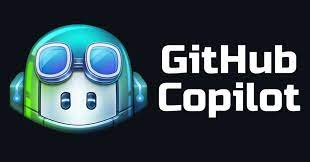

GitHub Copilot e ChatGPT: Impulsionando seu desenvolvimento com IA

- Aprendendo a implementar a extensão do github Copillot Labs no VSCode
- Criando Classes de jogadores para o jogo Pong com Github Copilot
- Entendendo com gerar a colisão para a bola no pong
- Fazendo melhorias nocenario

#exemplo de comando em portugues usados no copilot labs durante a criação

- Extrair uma classe chamada Bola para representar a posição e movimento e update e desenho da mesma

- Quando toca na borda em x reseta velocidade tambem atraves de função reset